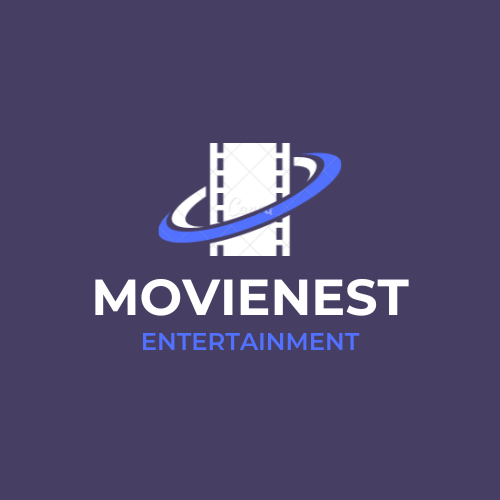

<h1 align="center">
  <b>MovieNest</b>
</h1>

  

## Nombre y descripcion 

MovieNest es un proyecto personal que tiene como objetivo proporcionar a los usuarios una plataforma donde puedan explorar, buscar y gestionar información sobre sus películas favoritas. La aplicación utiliza tecnologías web modernas para ofrecer una experiencia intuitiva y atractiva.

## Capturas de Pantalla

1. ### Seccion de inicio

2. ### Seccion de Buscar

3. ### Busqueda de la pelicula por nombre haciendo una solicitud REQUEST.POST a la API

4. ### Obtencion de la Informacion de la pelicula haciendo una solicitud REQUEST.GET a la API 

5. ### Seccion de Peliculas

6. ### Editar Informacion de la pelicula

7. ### Seccion de ayuda

## Funcionalidades Principales

- ### Inicio

La sección de inicio proporciona una introducción y una breve descripción de la aplicación, dando a los usuarios una visión general de lo que pueden esperar al utilizar MovieNest.

- ### Buscar

La sección de buscar utiliza una interfaz de búsqueda que se integra con la API de The Movie Database (TMDb) para obtener información detallada sobre películas. La vista procesa la solicitud del usuario, realiza la búsqueda en la API y presenta los resultados de manera dinámica en la plantilla.

- ### Películas

En la sección de películas, los usuarios pueden gestionar y guardar sus películas favoritas que buscan. Utiliza el modelo de Django para definir la estructura de la base de datos y MySQL como el motor de base de datos para garantizar un almacenamiento seguro y eficiente de la información. La vista se encarga de procesar las acciones del usuario (agregar, editar, eliminar) y actualizar la base de datos.

- ### Ayuda

La sección de ayuda proporciona guías detalladas sobre cómo utilizar las diversas funciones de la aplicación, incluyendo la búsqueda, gestión y edición de películas. Utiliza plantillas HTML para presentar la información de manera clara y accesible.

## Tecnologías Utilizadas

- ### Django

En la aplicacion, Django se utiliza como el motor principal del backend. sigue el patrón de diseño Modelo-Vista-Plantilla (MVT), donde:

1. #### Modelo

Representa la estructura de la base de datos, define los datos y las relaciones entre ellos. En MovieNest, el modelo se utiliza para gestionar información sobre las películas favoritas que guardan los usuarios.

2. #### Vista

Controla la lógica de presentación y maneja las interacciones entre el usuario y la aplicación. En las secciones de la aplicación, las vistas están encargadas de procesar las solicitudes del usuario y devolver las respuestas adecuadas.

3. #### Plantilla

Define la presentación y la estructura visual de las páginas web. Las plantillas en la app utilizan HTML para renderizar la información de manera dinámica.

- ### HTML y CSS

Estas tecnologías web fundamentales se utilizan para construir el frontend de la app. HTML define la estructura de las páginas web, CSS maneja la presentación y el diseño, y JavaScript se encarga de la interactividad del usuario. La combinación de estas tecnologías proporciona una interfaz de usuario dinámica y receptiva.

- ### Bootstrap

Facilita la creación de interfaces de usuario atractivas y compatibles con diversos dispositivos.

- ### MySQL

En la app, MySQL se emplea como el motor de base de datos para almacenar y recuperar información sobre las películas guardadas por los usuarios.

## Instalacion

### Requisitos Previos

Asegúrese de tener instalados los siguientes requisitos previos:

- #### Python

La aplicación utiliza Python como lenguaje de programación. Puede descargar e instalar la última versión de Python desde python.org.

- #### MySQL

Se utiliza MySQL como base de datos. Instale MySQL siguiendo las instrucciones para su sistema operativo desde MySQL Downloads.

### Pasos de Instalación

1. Clonar el repositorio
2. Configurar el entorno virtual y instalar las dependencias con el comando "pip install -r requirements.txt".
3. Configurar la Base de Datos

Cree una base de datos MySQL y configure las credenciales en el archivo settings.py en el directorio myproject/settings.py.

4. Ejecuta las migraciones con "python manage.py makemigrations" y despues ejecutar "python manage.py migrate".
5. Inicia el servidor de desarrollo local con el comando "python manage.py runserver".

## Uso

- ### Inicio

Explore la bienvenida y la descripción de la aplicación.

- ### Buscar

Utilice la interfaz de búsqueda para obtener información detallada sobre películas.

- ### Películas

Guarde y gestione sus películas favoritas en la sección dedicada.

- ### Ayuda

Consulte las guías detalladas sobre el uso de las funciones de la aplicación.
